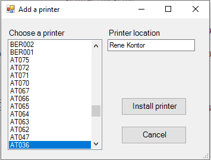

  A powershell script with a GUI, which shows available printers from added printserver, as well as the printers location-property. 
   
  A printer can be chosen from a list and installed from the GUI.
   
   
  
   

